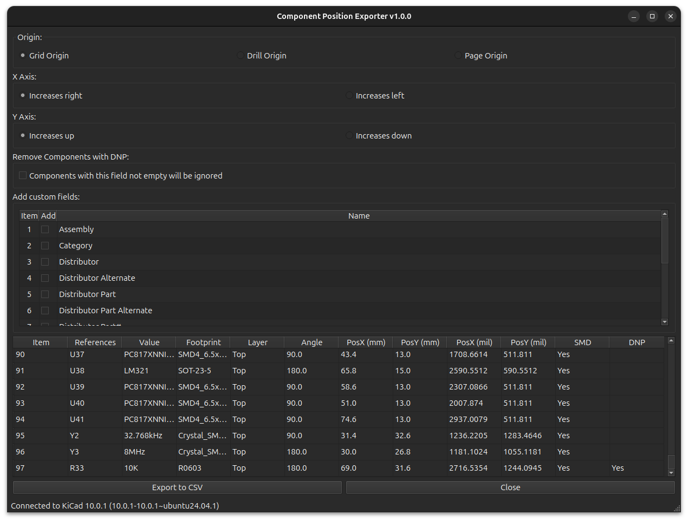

#  Component Position Exporter

  

**Component Position Exporter** is a powerful KiCad PCB plugin designed to generate accurate and customizable Component Placement List / Pick & Place files.

Unlike the default KiCad exporter, this plugin offers **Natural Sorting** (e.g., R2 comes before R10), smart **DNP (Do Not Populate)** handling, and the ability to include **Custom User Fields** (such as Manufacturer Part Numbers, LCSC IDs, etc.).

## 🚀 Key Features

* **🔤 Natural Sorting:** * Sorts Reference Designators logically (Natural Sort Order).
    * *Example:* `R1, R2, R10` instead of `R1, R10, R2`.
* **🚫 Smart DNP Handling:** * Automatically detects components marked as "Do Not Populate".
    * **Sorts DNP components to the very bottom** of the CSV list to separate them from the assembly bill.
    * Adds a clear "Yes" flag in the DNP column.
* **🔧 Custom Fields Support:**
    * Scans your board for all user-defined fields (e.g., `LCSC Part #`, `Voltage`, `Tolerance`).
    * Allows you to check/uncheck which extra fields to include in the CSV via the GUI.
* **📍 Flexible Coordinates:** * Supports both **Grid Origin** and **Drill Origin**.
    * Options to invert X/Y axis directions (e.g., "Increases left" or "Increases up").
    * Exports both **Metric (mm)** and **Imperial (mil)** units simultaneously.
* **📋 Clean Output:** Generates a standard CSV format compatible with most SMT assembly houses (JLCPCB, PCBWay, etc.).

## 🛠️ Installation

### 1. Installation via PCM (Recommended)
Add our custom repo to **the Plugin and Content Manager**, the URL is:
`https://raw.githubusercontent.com/thanhduongvs/kicad-repository/main/repository.json`

### 2. Installation via Source Code
- Download the plugin source code.
- Locate your KiCad plugins folder:
  - **Windows:** `Documents\KiCad\9.0\plugins`
  - **Linux:** `~/.local/share/kicad/9.0/plugins`
  - **macOS:** `~/Documents/KiCad/9.0/plugins`
- Create a folder named `component_position_exporter` inside the plugins directory.
- Copy all plugin files (`main.py`, `__init__.py`, `metadata.json`, `ui/`, etc.) into that folder.
- **Important:** Install required dependencies (`PySide6`, `shapely`, `qrcode`, `opencv-python`, `numpy`, `Pillow`) into KiCad's Python environment.
- Restart KiCad / PCB Editor.

## 🖥️ Usage

1.  Open your PCB design in **KiCad PCB Editor**.
2.  Click the **Component Position Exporter** icon on the toolbar (or find it under `Tools > External Plugins`).
3.  **Configure your settings:**
    * **Origin:** Choose between Grid Origin or Drill Origin.
    * **Axis:** Adjust X/Y direction if needed.
    * **Custom Fields:** Check the boxes for any additional data you want in the CSV (e.g., "Manufacturer").
    * **DNP:** Check to hide the DNP column (default includes it).
4.  Click **Generate**.
5.  The CSV file (`assembly/pos_your_board_name.csv`) will be saved in your project directory.

## 📄 Output Format

The generated CSV includes the following columns:

| Column | Description |
| :--- | :--- |
| **Item** | Sequential number (re-ordered based on sort logic) |
| **References** | Component Designator (e.g., R1, U2) |
| **Value** | Component Value (e.g., 10k, 100nF) |
| **Footprint** | KiCad Footprint Name |
| **Layer** | Top or Bottom |
| **Angle** | Rotation angle |
| **PosX / PosY** | Coordinates in mm and mils |
| **SMD** | Yes/No (Based on mounting type) |
| **DNP** | Yes (if applicable) |
| **[Custom Fields]** | Any extra fields selected in the GUI |

## 📦 Libraries Used
This project relies on several powerful open-source libraries:
 - [kicad-python](https://pypi.org/project/kicad-python/): KiCad API Python Bindings.
 - [PySide6](https://pypi.org/project/PySide6/): The official Python module from the Qt for Python project, used for the graphical user interface.

## 📜 License and Credits

Plugin code licensed under MIT, see `LICENSE` for more info.
