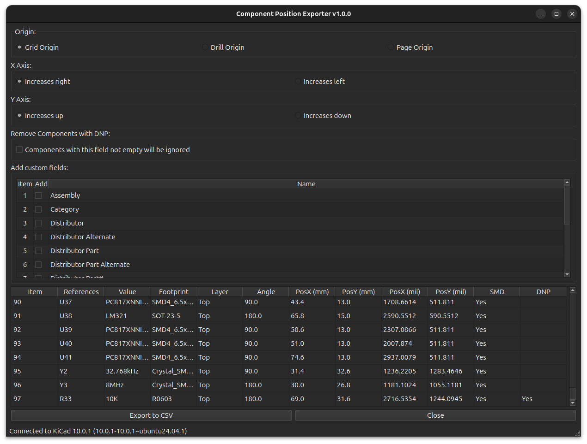

#  Component Position Exporter

  

**Component Position & BOM Exporter** is a professional KiCad plugin designed to generate accurate, customizable Component Placement Lists (Pick & Place) and standardized Bill of Materials (BOM) files in one go.



## 🚀 Key Features

* **📦 Dual Export:** Simultaneously generate Pick & Place (.csv) and a grouped BOM (.csv) formatted for PCBA manufacturing.
* **🖱️ Drag-and-Drop Ordering:** Arrange columns in your Position file by simply dragging headers in the live Preview Table.
* **🚫 Advanced DNP Handling:** * Completely remove DNP components or push them to the bottom.
    * Automatically adds a blank row separator in the BOM between populated and DNP items.
* **🔤 Smart Sorting:** Uses **Natural Sort** for Reference Designators (`R2` before `R10`) and sorts BOM by `Category` then `Value`.
* **🧹 Clean Data:** Automatically filters out simulation fields (`Sim.*`) and excludes components with Category `PCB`.
* **📂 One-Click Folder Access:** Directly open the `assembly` output directory from the GUI after exporting.

## 🛠️ Installation

### Option 1: Manual Installation (Recommended for Developers)

To install the plugin manually, follow these steps:

1.  **Locate your KiCad Plugin folder:**
    * **Windows:** `%APPDATA%\kicad\10\scripting\plugins`
    * **Linux:** `~/.local/share/kicad/10/scripting/plugins`
    * **macOS:** `~/Library/Preferences/kicad/10/scripting/plugins`
2.  **Clone or Download** this repository into the plugins folder.
3.  **Install Dependencies:**
    Open your terminal/command prompt and ensure you have the required libraries installed in the Python environment used by KiCad:
    ```bash
    pip install kicad-python PySide6
    ```
4.  **Restart KiCad** and the plugin will appear in the PCB Editor toolbar.

### Option 2: Plugin and Content Manager (PCM)
*(Coming Soon)* You will be able to install this directly through the KiCad PCM by adding our repository URL.

## 📄 Output Formats

Files are saved to your project's `/assembly/` subdirectory.

### 1. Position File (`pos_[board_name].csv`)
Configurable columns via the UI, including:
- **Item, References, Value, Footprint, Layer, Angle, Coordinates (mm/mil), SMD, DNP, and Custom Fields.**

### 2. Bill of Materials (`bom_[board_name].csv`)
Standardized 15-column format optimized for sourcing and assembly:
- **Item, Category, Value, References, Package, Description, Quantity, Assembly, Manufacturer, Manufacturer Part, Distributor, Distributor Part, Distributor Alternate, Distributor Part Alternate, DNP.**

## 📦 Libraries Used
- [kicad-python](https://pypi.org/project/kicad-python/) - KiCad API Bindings.
- [PySide6](https://pypi.org/project/PySide6/) - Qt framework for the modern GUI.

---
Developed by **OneKiwi Technology**.